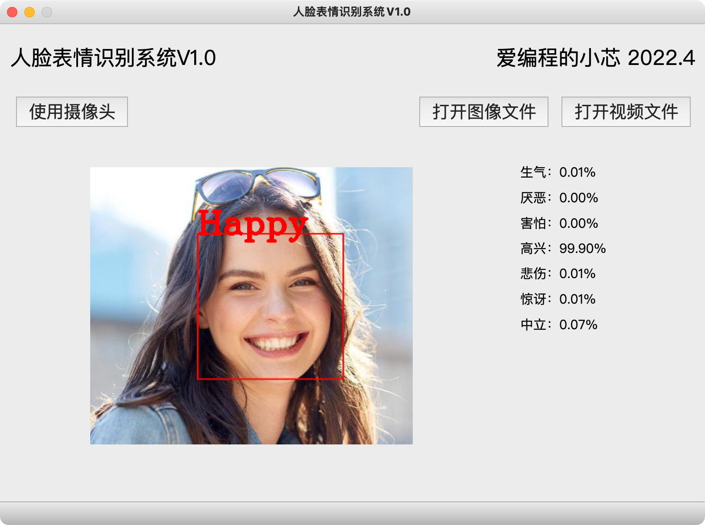

# 基于VGG的人脸表情识别系统

## 代码结构

+ dataset 存放数据集*
+ resources（测试素材）
+ **fer-2013.ipynb** （CNN的构建与训练）
+ FER_Model.h5 训练好的模型*
+ **FerAPP.py** 实时人脸预测（使用QT GUI)
+ haarcascade_frontalface_default.xml（OpenCV提供的人脸检测器）
+ logo.png（Logo文件）
+ RealTimeFER.py 实时人脸预测（OpenCV原始GUI）
+ res.qrc（QT资源文件，请用PyRCC转换为res_rc.py）
+ res_rc.py（QT资源-Python代码）
+ video_page.py（QT GUI代码）
+ video_page.ui（QT GUI设计文件，请用QT Designer打开，并用PyUIC工具转换为video_page.py）

主要代码在fer-2013.ipynb中，FER_Model.h5是由该代码训练得出的模型

运行FerApp.py可调用FER_Model.h5演示程序效果。

*数据集和训练好的模型请通过百度网盘下载：

链接:https://pan.baidu.com/s/12N8TofccWOFfETy80V2Qog?pwd=hux7

提取码:hux7

## 运行代码

### 配置环境

1. 创建虚拟环境
    ```shell
    conda create -n fer python=3.7
    ```
2. 激活虚拟环境
    ```shell
    conda activate fer
    ```
3. 安装相关Python包
    ```shell
    pip install -r requirements.txt
    ```


### 训练模型（不需要可跳过）

使用Jyputer NoteBook打开 [fer-2013.ipynb](./fer-2013.ipynb) 按步骤运行。

### 运行演示程序

```shell
python FerApp.py
```

效果如下：



## 参考文献和引用

1. [KHAIREDDIN Y, CHEN Z. Facial Emotion Recognition: State of the Art Performance on FER2013【J】.arXiv, 2021.](https://arxiv.org/abs/2105.03588v1)
2. https://github.com/usef-kh/fer
3. https://github.com/bakerv/fer-webcam